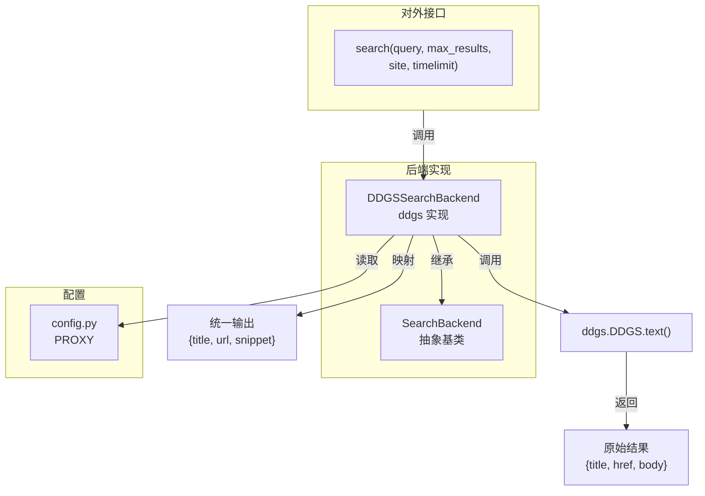
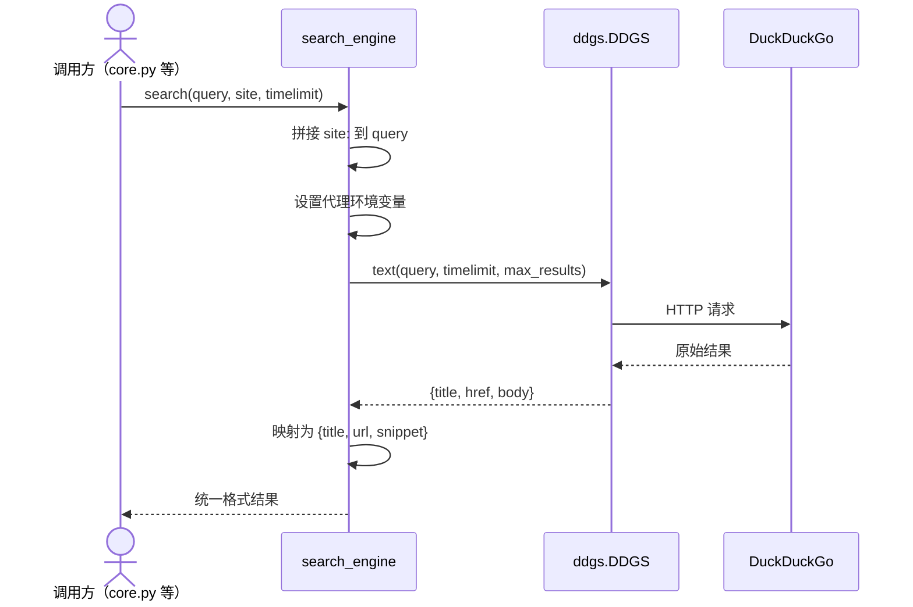

# search_engine 代码图谱



## 调用链



## 目录结构

```
search_engine/
  ├── __init__.py        # search() 统一接口
  ├── config.py          # 代理配置
  ├── backends/
  │   ├── __init__.py
  │   ├── base.py        # 抽象基类
  │   └── ddgs.py        # ddgs 实现
  └── intro/
      ├── user_guide.md  # 使用说明
      └── code_atlas.md  # 代码图谱
```

## 扩展方式

新增后端：在 `backends/` 下创建新文件，继承 `SearchBackend`，实现 `search()`，返回 `[{title, url, snippet}]`。
