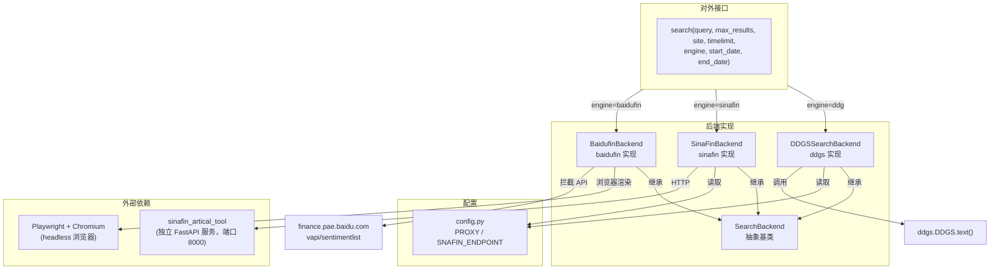
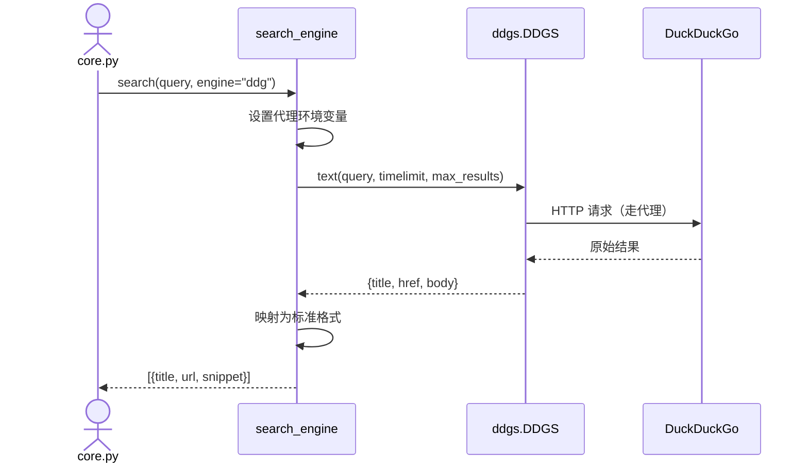
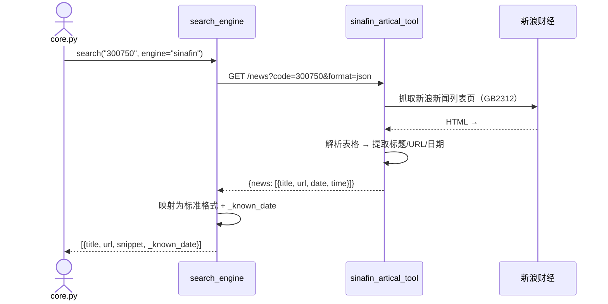
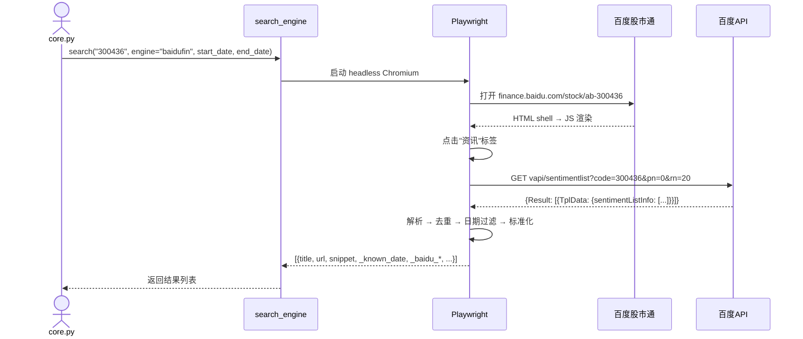

# search_engine 代码图谱

## 架构



## 调用链

### DDG 引擎



### Sinafin 引擎



### Baidufin 引擎



## 目录结构

```
search_engine/
├── __init__.py            # search() 统一接口（engine 分发）
├── config.py              # 代理配置 + sinafin 端点配置
├── backends/
│   ├── __init__.py
│   ├── base.py            # SearchBackend 抽象基类
│   ├── ddgs.py            # DDG 搜索实现
│   ├── sinafin.py         # sinafin 个股新闻实现
│   └── baidufin.py        # 百度股市通个股资讯实现（v3.0 新增）
└── intro/
    ├── user_guide.md      # 使用说明
    └── code_atlas.md      # 代码图谱
```

## 扩展方式

新增后端：
1. 在 `backends/` 下创建新文件，继承 `SearchBackend`
2. 实现 `search()` 方法
3. 在 `__init__.py` 中添加 `engine` 分发分支

返回格式必须为 `[{title, url, snippet, ...}]`。
可扩展自定义字段（如 `_known_date`、`_baidu_sentiment` 等），调用方按需读取。

### baidufin 特有字段

| 字段 | 类型 | 说明 |
|------|------|------|
| `_known_date` | str | 精确发布日期 `"2026-07-21"` |
| `_baidu_sentiment` | str | 情绪分类：`"利好"` / `"中性"` / `"利空"` |
| `_baidu_provider` | str | 新闻来源：`"证券之星"` / `"东方财富网"` / `"同花顺"` |
| `_baidu_abstract` | str | 新闻摘要（可用作正文预览） |
| `_baidu_ts` | int | Unix 时间戳 |

### 注意事项

- baidufin 依赖 Playwright + Chromium，约 200MB
- 搜索在独立线程中执行（兼容 asyncio 调用方）
- 通过拦截百度内部 API 获取结构化数据，无需解析 HTML
