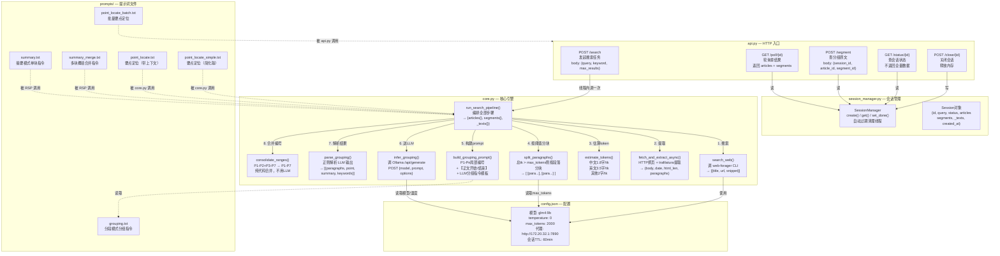
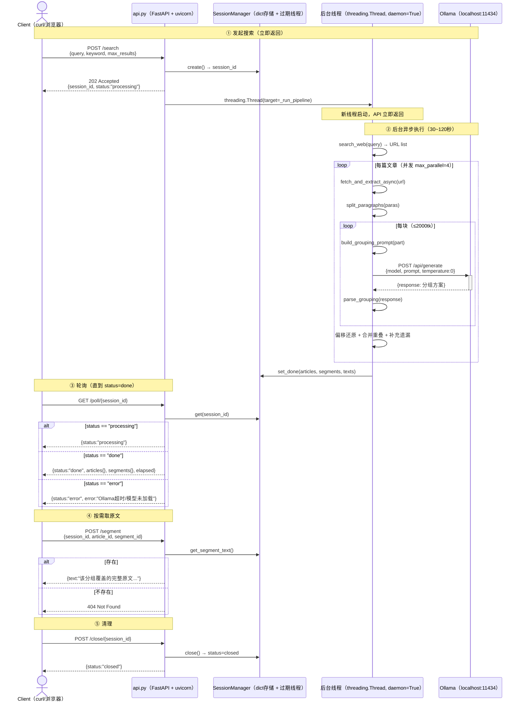
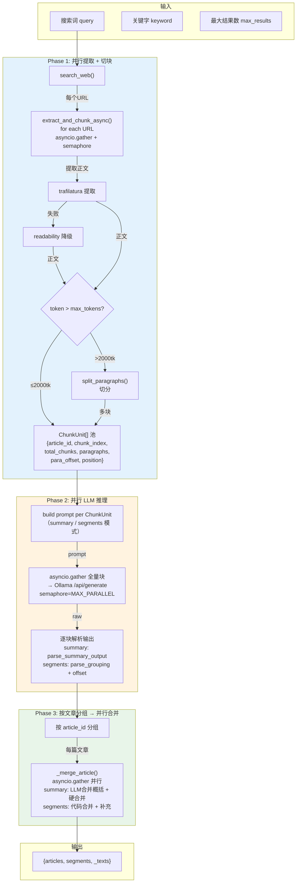

# bot_search 代码图谱

## 阅读指南

### 图例

| 符号 | 含义 |
|---|---|
| `graph TB` | 模块依赖关系（谁调谁，谁是父模块） |
| `sequenceDiagram` | API 调用时序（客户端→服务端→模型） |
| `flowchart LR/TB` | 数据流 / 处理流程 |
| `graph LR` | 数据结构关系 |
| `box[...<br/>一句话职责]` | 模块/函数 + 它做什么 |
| `-->`\|\|数字. 步骤\|` | 调用/数据流向 + 执行顺序 |
| `alt ... end` | 条件分支 |
| `loop ... end` | 循环处理（如多块、多文章） |
| `Note over` | 阶段分区说明 |

### 每节结构

每节遵循三个层次：
1. **主图** — 一张 Mermaid 图展示全貌
2. **关键标注** — 图里不便于表达的细节，用表格补充
3. **设计要点** — 为什么这样做的决策依据

---

## 1. 模块关系



### 关键标注

| 调用方 | 被调方 | 调用时机 | 备注 |
|---|---|---|---|
| `api.py` endpoints | `run_search_pipeline()` | `/search` 时调 1 次 | 新线程中执行，不阻塞 |
| `run_search_pipeline()` | `search_web()` | 流程开始，调 1 次 | web-forager 需代理 |
| `run_search_pipeline()` | `fetch_and_extract_async()` | 每篇文章 | 并发 max_parallel=4 |
| `run_search_pipeline()` | `split_paragraphs()` | 每篇文章 | 超 max_tokens 才拆分 |
| `run_search_pipeline()` | `build_grouping_prompt()` + `infer_grouping()` | 每块 | 块内 P1-Pn 局部编号 |
| `run_search_pipeline()` | `parse_grouping()` + `consolidate_ranges()` | 每块结果 | 解析+合并，代码层完成 |

### 设计要点

- **分块在代码层，LLM 不可见**：LLM 永远只看到一块完整的文章（如 P1-P58），不知道自己被"分块了"
- **合并也是代码层**：相邻分组段落号重叠就合并（`end_p >= next.start_p`），不做二次 LLM 推理，稳定快速
- **遗漏补充也是代码层**：LLM 漏掉的段落用 `[补充]` 标记填补，不送回 LLM 重做
- **大模型只做语义判断**（哪些段落话题相近），数字运算（编号偏移、合并区间）全由代码完成

---

## 2. API 设计



### 端点速查

| 方法 | 路径 | 请求体/参数 | 响应（成功） | 说明 |
|---|---|---|---|---|
| POST | `/search` | `{query, keyword, max_results}` | `{session_id, status:"processing"}` | 立即返回，后台处理 |
| GET | `/poll/{session_id}` | path param | `{status, articles, segments, elapsed}` | 反复调直到 done |
| POST | `/segment` | `{session_id, article_id, segment_id}` | `{text:"原文..."}` | 取某分组的原始正文 |
| GET | `/status/{session_id}` | path param | `{status, query, article_count, elapsed}` | 不返回全量数据 |
| POST | `/close/{session_id}` | path param | `{status:"closed"}` | 主动关闭，释放内存 |

### 设计要点

- **异步非阻塞**：`/search` 后台线程执行，API 立即返回 session_id，客户端轮询
- **线程隔离**：每个 `/search` 一个独立线程，互不干扰；threading 而非 asyncio 是因为 LLM 调用是同步阻塞的
- **会话即 Session 对象**：全量结果缓存在内存中，TTL=60min 自动过期，无外部存储依赖
- **`/status` vs `/poll`**：`/status` 只返回概览（轻量），`/poll` 返回全量数据（重量），按需调用

---

## 3. Pipeline 流程（两阶段并行）



### 并行策略

| 阶段 | 实现 | 并发控制 |
|---|---|---|
| 提取+切块 | `asyncio.gather`所有URL → `extract_and_chunk_async()`内完成提取+切块 | sem_fetch = MAX_PARALLEL |
| LLM推理 | `asyncio.gather`全量ChunkUnit一并送Ollama | sem_llm = MAX_PARALLEL |
| 合并 | `asyncio.gather`按article_id分组后并行合并 | 全量gather |

### ChunkUnit 结构

```python
@dataclass
class ChunkUnit:
    article_id: str      # 所属文章 ID
    title / url / date / snippet / source  # 文章元信息
    chunk_index: int     # 第几块（0-based）
    total_chunks: int    # 总块数（1=整篇未切）
    paragraphs: list     # 本块段落列表
    para_offset: int     # 全局段落偏移（segments模式还原用）

    # 衍生属性（不存储，运行时计算）
    is_splitted = total_chunks > 1        # 是否被分过块
    position = "开头"/"中间"/"结尾"/""    # 用于 prompt 标注
```

### 要点定位并行

`POST /point-text` 收到多点请求后，按 chunk 分组并行送 LLM：

```
请求 [2,7,5]
  → 分组: 块1→[2,5], 块2→[7]
  → asyncio.gather(
       块1: 批次prompt → LLM → 解析,
       块2: 单点prompt → LLM → 解析
     )
  → 汇总排序 → 返回
```

---

## 4. 数据结构

```mermaid
graph LR
  subgraph Pipeline_Output["run_search_pipeline() 返回值"]
    Result["{<br/>  articles: {},<br/>  segments: {},<br/>  _texts: {}<br/>}"]
  end

  subgraph Articles["articles{} — 文章列表"]
    A01["a_01<br/>{<br/>  title: 标题<br/>  url: 链接<br/>  source: 来源<br/>  date: 日期<br/>  charnum: 总字符<br/>  segments: [{id, charnum}...]<br/>}"]
  end

  subgraph Segments["segments{} — 分组要点"]
    S01["a_01_s1<br/>{<br/>  article_id: a_01<br/>  point: 要点<br/>  summary: 概括<br/>  keywords: 关键字<br/>  charnum: 块字符数<br/>}"]
    S02["a_01_s2<br/>{<br/>  article_id: a_01<br/>  point: 要点<br/>  summary: 概括<br/>  keywords: 关键字<br/>  charnum: 块字符数<br/>}"]
  end

  subgraph Texts["_texts{} — 分组原文"]
    T01["a_01 → {<br/>  s1: 该组完整原文...<br/>  s2: 该组完整原文...<br/>}"]
  end

  subgraph Internal["内存结构 — Session._texts"]
    SEG["s1 → 段落原文<br/>(LLM分组后,<br/>代码按段落号截取)"]
  end

  Result --> Articles
  Result --> Segments
  Result --> Texts

  A01 -->|.segments[0].id = s1| S01
  A01 -->|.segments[1].id = s2| S02
  A01 -->|通过 article_id| T01
  T01 -->|.s1| SEG
  S01 -->|.article_id| A01
```

### 字段速查

**articles[article_id]**

| 字段 | 类型 | 来源 | 说明 |
|---|---|---|---|
| `title` | string | 搜索结果 | 文章标题 |
| `url` | string | 搜索结果 | 原文链接 |
| `source` | string | URL提取 | 域名，如 `example.com` |
| `date` | string | 页面meta/摘要 | 发布日期 |
| `charnum` | number | 正文统计 | 总字符数 |
| `segments` | array[{id,charnum}] | 组合 | 分组列表（不含要点） |

**segments[article_id_segment_id]**

| 字段 | 类型 | 来源 | 说明 |
|---|---|---|---|
| `article_id` | string | 分配 | 所属文章 |
| `point` | string | **LLM生成** | 核心要点（15-50字） |
| `summary` | string | **LLM生成** | 内容概括（50-100字） |
| `keywords` | string | **LLM生成** | 关键字（≤10字） |
| `charnum` | number | 正文统计 | 该分组原文总字符 |

**数据流向**：LLM 做语义分组 → 代码截取对应原文 → `_texts[article_id][segment_id]` 存原文 → `POST /segment` 对外暴露

---

## 5. 细节披露

> 本节记录开发过程中容易忽略的关键细节。按"问题 — 原因 — 解决方案"格式组织。

### 5.1 temperature=0 是硬约束，不是建议

| 项 | 内容 |
|---|---|
| 问题 | 同一篇文章两次调用 LLM 分组结果不一致，段落覆盖时好时坏 |
| 原因 | temperature=0.1 时模型有随机性，相同 prompt 输出不同分组方案 |
| 解决 | 强制 temperature=0，输出完全确定。**这是调试的前提**——否则你分不清是代码 bug 还是 LLM 随机 |
| 验证 | 同一 prompt 调用 3 次，输出必须逐字相同 |

### 5.2 LLM 有效注意力窗口 ~5000 字（不是 128K）

| 项 | 内容 |
|---|---|
| 问题 | 超过 6000 字的文章，LLM 只覆盖后半部分段落，或输出不完整的分组 |
| 原因 | GLM4:9b 宣称 128K 上下文，但实际**有效**注意力约 5000 字正文 / 6500 字总 prompt。超出后出现：近因效应（只关注末尾）+ 格式漂移（不按指定格式输出） |
| 解决 | max_tokens=2000（约 3600-7000 字）作为分块阈值，留有充足安全余量。每块在 LLM 有效窗口内 |
| 教训 | 厂商宣称的上下文长度 ≠ 实际可用长度。**必须实测**当前模型的有效窗口 |

### 5.3 为什么每块用 P1-Pn 局部编号，而不是全局 P1-P116

| 项 | 内容 |
|---|---|
| 问题 | 分块后直接把原始编号（如 P1-P58 和 P59-P116）送入 LLM，LLM 输出引用了不存在的编号 |
| 原因 | LLM 混淆了"文章有 116 段"和"当前块只有 58 段"这两个事实，输出 P99、P100 等块内不存在编号 |
| 解决 | 每块重新编号 P1-Pn，LLM 只处理块内内容。输出后代码做偏移还原：块2的 P1 → 全局 P59 |
| 口诀 | LLM 永远只看到局部编号——像看一篇文章那样看一块 |

### 5.4 为什么合并用代码不用 LLM（stage2 为什么暂停）

| 项 | 内容 |
|---|---|
| 问题 | stage2 用 LLM 合并 26 个分组结果，LLM 一次性压缩到 13 组，丢失了 54 个段落的覆盖 |
| 原因 | LLM 合并时"过度概括"，把 P8-P60（53 段）塞进同 1 组，丢失了大量细节 |
| 解决 | **代码合并**：相邻分组段落号重叠则自动合并（`end_p >= next.start_p`），要点/概括/关键字字符串拼接。不做语义判断，只做范围拼接 |
| 原则 | LLM 做"扩"（分组判断），代码做"缩"（合并、填充、编号运算） |

### 5.5 【正文开始】/【正文结束】标记的作用

| 项 | 内容 |
|---|---|
| 问题 | 早期 prompt 不加边界标记，LLM 有时把 prompt 指令当正文处理，输出乱码 |
| 解决 | 用 `【正文开始】/【正文结束】` 明确标记 LLM 需要处理的文本范围，prompt 中注明"只有这两个标记之间的内容才是正文" |
| 效果 | LLM 准确区分"指令"和"处理对象"，格式稳定性明显提升 |

### 5.6 estimate_tokens 公式

| 项 | 内容 |
|---|---|
| 公式 | `chinese/1.8 + ascii/3.5 + other/2 + 1` |
| 中文 | 约 1.8 字/token（中文文章实测） |
| 英文 | 约 3.5 字符/token（ASCII 可打印字符） |
| 其他 | 约 2 字符/token（数字、标点、混合字符） |
| 用途 | 仅用于分块决策，不用于精确定量。只要估得偏大（严格分块）即可 |

### 5.7 max_tokens=2000 的安全余量策略

| 项 | 内容 |
|---|---|
| 策略 | 目标块大小设为 2000 token（而非 GLM4 实际窗口的 5000 字） |
| 原因 | ① prompt 模板本身占 ~700-900 字 ② 段落边界可能让块略超 ③ 保留余量应对不同文章的 token 密度差异 |
| 效果 | 实际每块 2000tk ≈ 3600-7000 字（中文），远低于 5000 字的注意力衰减线 |

### 5.8 后台线程：为什么 threading 而不是 asyncio

| 项 | 内容 |
|---|---|
| 原因 | `POST /api/generate` 是同步 HTTP 请求（httpx 同步客户端），在一个 asyncio 协程中执行同步阻塞调用会阻塞整个事件循环 |
| 解决 | `api.py` 用 FastAPI（asyncio）接收请求、返回响应。`run_search_pipeline()` 用 `threading.Thread` + 独立 `asyncio.new_event_loop()` 执行。API 线程不阻塞 |
| 模式 | asyncio 处理 IO 密集的 HTTP 请求，threading 处理 CPU/阻塞密集的 LLM 推理 |

### 5.9 会话过期策略

| 项 | 内容 |
|---|---|
| TTL | 60 分钟（config.session.ttl_minutes） |
| 检查频率 | 后台线程每 60 秒扫描一次 |
| 过期动作 | `status → closed`（不可查询，但仍保留在内存） |
| 清理动作 | 超过 TTL+10 分钟的 closed 会话从 `_sessions` dict 删除 |
| 原因 | 防止长时间运行后内存泄漏 |

### 5.10 外部依赖

| 工具 | 用途 | 必须？ |
|---|---|---|
| Ollama | 本地 LLM 推理 | ✅ 必须 |
| web-forager | 网络搜索（CLI） | ✅ 必须 |
| trafilatura | 正文提取 | ✅ 自动安装 |
| readability-lxml | 正文提取降级 | ✅ 自动安装 |
| html2text | HTML→Markdown 转换 | ✅ 自动安装 |
| 代理（proxy） | 访问外网搜索+抓页 | ⚠️ 需配置 |

> web-forager 需要单独安装并且在 PATH 中。其他 Python 依赖通过 `pip install -r requirements.txt` 安装。

### 5.11 Prompt 外置管理

| 项 | 内容 |
|---|---|
| 设计 | 所有 LLM 指令模板存放在 `prompts/` 目录，代码通过 `build_*_prompt()` 函数读取并注入参数 |
| 文件数 | 7 个 `.txt` 文件，每个对应一种 LLM 调用场景 |
| 加载时机 | 模块导入时读取一次，缓存在 `_prompt_*_template` 全局变量中 |
| 修改方式 | 直接编辑 `prompts/*.txt`，重启服务生效，无需改代码 |
| 优势 | ① prompt 迭代不涉及代码变更 ② 可对比不同版本 ③ 非开发者也能修改 |

**文件清单**：

| 文件 | 使用函数 | 注入参数 | 场景 |
|---|---|---|---|
| `grouping.txt` | `build_grouping_prompt()` | `{n}` 段落总数, `{numbered}` P1-Pn 正文 | segments 模式分组 |
| `summary.txt` | `build_summary_prompt()` | `{query}`, `{keyword}`, `{body}` | summary 模式单块 |
| `summary_merge.txt` | `build_merge_prompt()` | `{query}`, `{keyword}`, `{chunk_summaries}` | 多块概括合并 |
| `point_locate.txt` | `build_point_locate_prompt()` | `{all_key_points_text}`, `{target_index}`, `{key_point}`, `{numbered_body}` | 单点定位（带上下文） |
| `point_locate_simple.txt` | `build_point_locate_prompt()` 降级 | `{key_point}`, `{numbered_body}` | 单点定位（无上下文） |
| `point_locate_batch.txt` | `/point-text` 批量分支 | `{point_list}`, `{numbered_body}` | 批量要点定位 |
