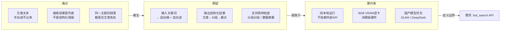
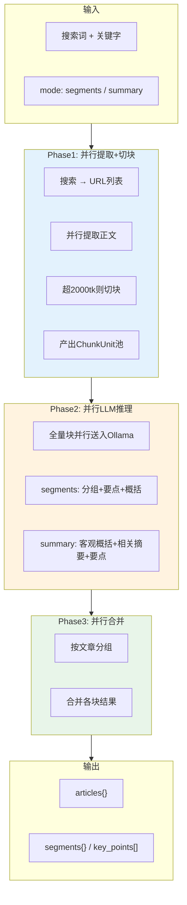
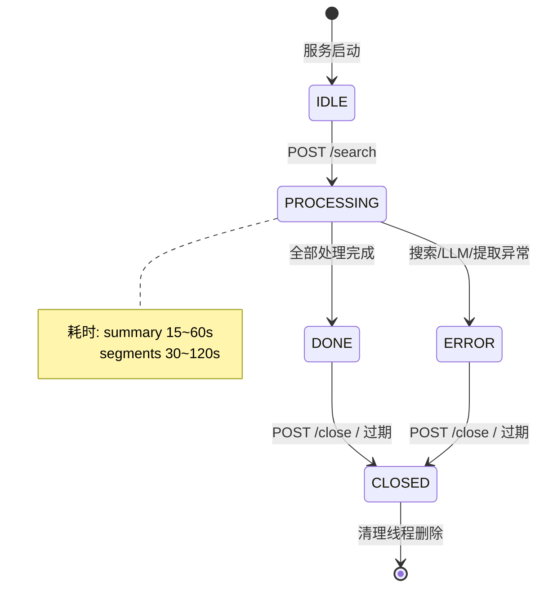
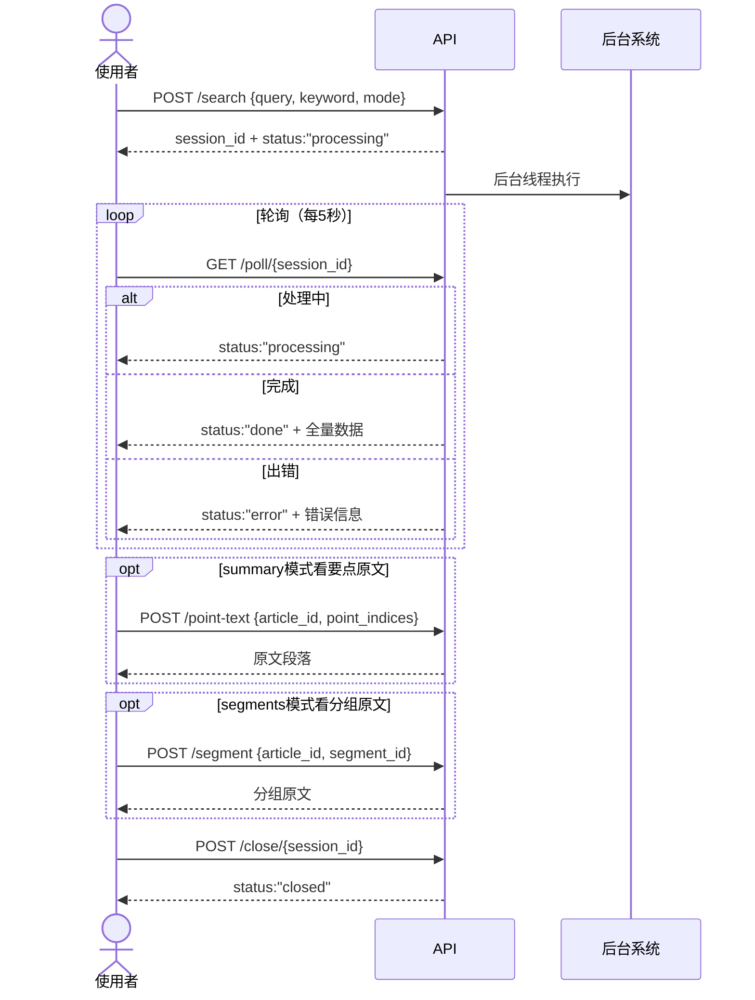
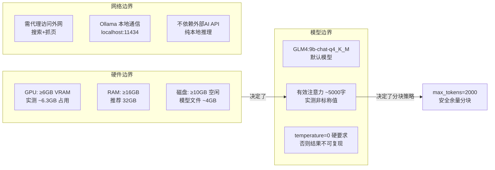
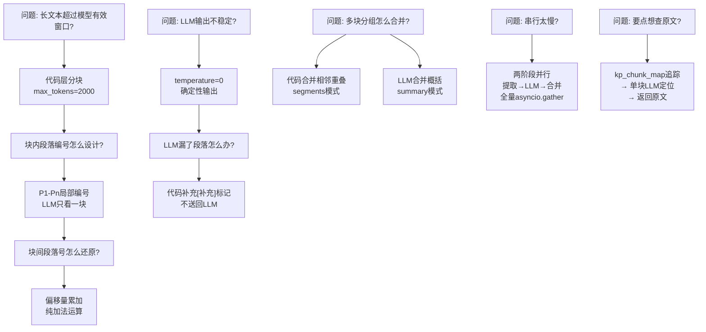

# bot_search API 需求说明书

## 1. 需求来源

**一句话需求**：输入搜索词 → 自动搜文章 → 本地 LLM 处理 → 输出 JSON，全程 8GB VRAM 硬件上跑，支持段落分组和整篇摘要两种模式。

---

## 2. 需求树

```mermaid
graph TB
  REQ["bot_search API"] --> FUNC["功能需求"]
  REQ --> NONFUNC["非功能需求"]
  REQ --> LIMIT["边界与限制"]

  FUNC --> F1["搜索（网络）"]
  FUNC --> F2["提取（正文）"]
  FUNC --> F3["LLM处理"]
  FUNC --> F4["输出（结构化JSON）"]
  FUNC --> F5["API（RESTful）"]

  F1 --> F1a["web-forager 调用<br/>DuckDuckGo 引擎"]
  F1 --> F1b["代理适配<br/>HTTP/HTTPS"]
  F1 --> F1c["结果上限控制<br/>max_results≤10"]

  F2 --> F2a["网页抓取<br/>HTTP GET + headers"]
  F2 --> F2b["正文提取<br/>trafilatura 做主"]
  F2 --> F2c["降级方案<br/>readability 兜底"]
  F2 --> F2d["段落切分<br/>双换行分割"]

  F3 --> F3a["自动分块<br/>超2000tk切分"]
  F3 --> F3b["LLM推理<br/>Ollama /api/generate"]
  F3 --> F3c["segments模式<br/>按段落分组+要点+概括+关键字"]
  F3 --> F3d["summary模式<br/>整篇摘要+相关摘要+核心要点"]
  F3 --> F3e["跨块处理<br/>LLM合并概括+硬合并要点/摘要"]

  F4 --> F4a["articles{}<br/>文章元信息+处理结果"]
  F4 --> F4b["segments{}<br/>分组要点（segments模式）"]
  F4 --> F4c["_texts{}<br/>原文+要点→块映射"]

  F5 --> F5a["POST /search<br/>发起异步任务"]
  F5 --> F5b["GET /poll<br/>轮询结果"]
  F5 --> F5c["POST /segment<br/>查分组原文"]
  F5 --> F5d["POST /point-text<br/>查要点原文（summary模式）"]
  F5 --> F5e["GET /status<br/>查概览"]
  F5 --> F5f["POST /close<br/>清理会话"]

  NONFUNC --> NF1["异步非阻塞<br/>搜索不等待"]
  NONFUNC --> NF2["确定性输出<br/>temperature=0"]
  NONFUNC --> NF3["两阶段并行<br/>提取→LLM→合并全并行"]
  NONFUNC --> NF4["会话隔离<br/>互不干扰"]
  NONFUNC --> NF5["自动过期<br/>TTL=60min"]
  NONFUNC --> NF6["容错优先<br/>部分失败不影响整体"]

  LIMIT --> L1["模型: GLM4:9b<br/>~6.3GB VRAM"]
  LIMIT --> L2["上下文: ~5k字/块<br/>实测有效窗口"]
  LIMIT --> L3["不包含Stage2/3<br/>本版本不做LLM二次合并/精炼"]
  LIMIT --> L4["无前端UI<br/>纯JSON API"]
  LIMIT --> L5["无持久化存储<br/>内存+过期"]
```

---

## 3. 数据流逻辑

---

## 4. 状态与交互逻辑

### 客户端交互流程

---

## 5. 约束与验收

### 硬件约束

### 验收标准

| # | 验收项 | 标准 | 优先级 |
|---|---|---|---|
| 1 | 搜索可用 | `POST /search` 返回 session_id | P0 |
| 2 | 轮询可用 | `GET /poll` 最终返回 done + 数据 | P0 |
| 3 | segments模式 | 每篇所有段落都被分配到某个分组 | P0 |
| 4 | summary模式 | 每篇产出 summary + summary_relevant + key_points | P0 |
| 5 | 确定性 | 同一篇正文连续调用 3 次，结果一致 | P1 |
| 6 | 长文本处理 | ≥8000 字文章不崩溃、不超时、不空输出 | P1 |
| 7 | 多块合并 | summary模式多块文章的概括合并正确 | P1 |
| 8 | 要点定位 | POST /point-text 能准确定位到原文段落 | P1 |
| 9 | 并发 | 连续两次搜索，两个 session 独立 | P1 |
| 10 | 自动过期 | 60 分钟后 session 自动 closed | P2 |
| 11 | 降级能力 | trafilatura 失败时 readability 兜底 | P2 |

### 版本边界

| 包含于本版本 | 不包含于本版本 |
|---|---|
| ✅ segments: LLM 分组（要点+概括+关键字） | ❌ Stage 2: LLM 跨块二次合并 |
| ✅ summary: LLM 整篇摘要+相关摘要+要点 | ❌ Stage 3: LLM 精炼复核 |
| ✅ 跨块 LLM 概括合并 | ❌ 前端 UI |
| ✅ 要点→原文反向定位（POST /point-text） | ❌ 数据库持久化 |
| ✅ 两阶段并行架构 | ❌ 多模型自动切换 |
| ✅ RESTful API + 会话管理 | ❌ 流式输出（stream） |
| ✅ token 估算 + 自动分块 | |

---

## 6. 关键设计决策图谱

---

**原则总结**：LLM 只做语义判断，数字运算和流程编排由代码完成。所有 LLM 调用并行化，按两阶段组织。
