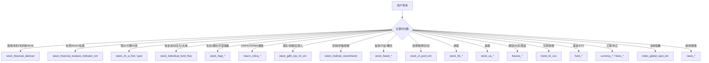

# akshare 知识图谱

> 查询入口: 根据用户问题，按"实体 → 关系 → 数据源/API"路径查找
> 所有 API 返回 pandas.DataFrame
> 格式参考: `API名称(参数: 类型) → 返回值`

---

## 一、实体关系图

### 1.1 核心金融实体链

```
公司/股票 (stock code)
    ├── 财务数据 → stock_financial_abstract / stock_financial_analysis_indicator_em
    │   ├── 利润表 → stock_profit_sheet_by_report_em
    │   ├── 资产负债表 → stock_balance_sheet_by_report_em
    │   ├── 现金流量表 → stock_cash_flow_sheet_by_report_em
    │   ├── 杜邦分析 → stock_zh_dupont_comparison_em
    │   ├── 成长能力 → stock_zh_growth_comparison_em
    │   ├── 估值对比 → stock_zh_valuation_comparison_em
    │   └── 规模对比 → stock_zh_scale_comparison_em
    │
    ├── 行情 → stock_zh_a_hist / stock_zh_a_spot_em / stock_zh_a_hist_min_em
    │
    ├── 资金流向 → stock_individual_fund_flow
    │   └── 市场资金 → stock_market_fund_flow / stock_sector_fund_flow_hist
    │
    ├── 股东/持仓
    │   ├── 十大股东 → stock_gdfx_top_10_em
    │   ├── 股东户数 → stock_zh_a_gdhs
    │   ├── 实控人 → stock_hold_control_cninfo
    │   └── 高管 → stock_hold_management_detail_em
    │
    ├── 机构持仓
    │   ├── 汇总 → stock_institute_hold
    │   ├── 评级 → stock_institute_recommend / stock_institute_recommend_detail
    │   └── 研报 → stock_research_report_em
    │
    ├── 公告/事件
    │   ├── 分红送配 → stock_fhps_em
    │   ├── 业绩报表 → stock_yjbb_em / stock_yjkb_em / stock_yjyg_em
    │   ├── 上市公告 → stock_ipo_info
    │   └── 公司公告 → stock_zh_a_gbjg_em
    │
    └── 融资/质押
        ├── 融资融券 → stock_margin_sse / stock_margin_szse
        └── 股权质押 → stock_gpzy_profile_em

### 1.5 官方信息披露 — 巨潮资讯网（\*_cninfo）

```
上市公司 (code)
    ├── 公司概况 → stock_profile_cninfo
    ├── IPO上市信息 → stock_ipo_summary_cninfo
    ├── 历史分红 → stock_dividend_cninfo
    ├── 配股 → stock_allotment_cninfo
    ├── 股本变动 → stock_share_change_cninfo
    │
    ├── 股东股本
    │   ├── 实际控制人持股变动 → stock_hold_control_cninfo
    │   ├── 股东人数及集中度 → stock_hold_num_cninfo
    │   └── 高管持股变动 → stock_hold_management_detail_cninfo
    │
    ├── 公司治理
    │   ├── 股权质押 → stock_cg_equity_mortgage_cninfo
    │   ├── 对外担保 → stock_cg_guarantee_cninfo
    │   └── 公司诉讼 → stock_cg_lawsuit_cninfo
    │
    ├── 行业分类
    │   ├── 行业归属 → stock_industry_category_cninfo
    │   ├── 行业归属变动历史 → stock_industry_change_cninfo
    │   └── 行业市盈率 → stock_industry_pe_ratio_cninfo
    │
    ├── 信息披露（公告）
    │   ├── 公告查询 → stock_zh_a_disclosure_report_cninfo
    │   ├── 预约披露 → stock_zh_a_disclosure_relation_cninfo
    │   ├── 互动易提问 → stock_irm_cninfo
    │   └── 互动易回答 → stock_irm_ans_cninfo
    │
    ├── 新股
    │   ├── 新股发行 → stock_new_ipo_cninfo
    │   ├── 新股过会 → stock_new_gh_cninfo
    │   └── 投资评级 → stock_rank_forecast_cninfo
    │
    ├── 基金持仓（巨潮版）
    │   ├── 基金重仓股 → fund_report_stock_cninfo
    │   ├── 基金资产配置 → fund_report_asset_allocation_cninfo
    │   └── 基金行业配置 → fund_report_industry_allocation_cninfo
    │
    └── 债券发行（巨潮版）
        ├── 国债发行 → bond_treasure_issue_cninfo
        ├── 企业债发行 → bond_corporate_issue_cninfo
        ├── 地方债发行 → bond_local_government_issue_cninfo
        ├── 可转债发行 → bond_cov_issue_cninfo
        └── 可转债转股 → bond_cov_stock_issue_cninfo
```
```

### 1.2 资金流关系

```
资金流查询:
    北向资金（沪深港通）
        ├── stock_hsgt_hist_em → 历史净流入
        ├── stock_hsgt_fund_flow_summary_em → 当日汇总
        ├── stock_hsgt_hold_stock_em → 持股明细
        └── stock_hsgt_individual_em → 个股北向资金
    
    主力资金
        ├── stock_main_fund_flow → 全市场
        ├── stock_individual_fund_flow → 个股（大单/超大单/中单/小单）
        └── stock_market_fund_flow → 市场汇总
    
    行业资金
        ├── stock_sector_fund_flow_hist → 板块历史
        └── stock_fund_flow_industry → 行业排名
```

### 1.3 宏观指标 → 股票联动关系

```
中国宏观 → A股联动:
    ├── GDP增速 → 周期股影响 (macro_china_gdp)
    ├── PMI → 制造业景气 (macro_china_pmi)
    ├── CPI/PPI → 消费/上游利润 (macro_china_cpi, macro_china_ppi)
    ├── M2/社融 → 流动性 (macro_china_money_supply, macro_china_shrzgm)
    ├── LPR/利率 → 估值分母 (macro_china_lpr, macro_china_shibor_all)
    ├── 外贸进出口 → 出口企业 (macro_china_exports_yoy / macro_china_imports_yoy)
    ├── 房地产投资 → 地产链 (macro_china_real_estate)
    └── BDI航运 → 大宗商品/外贸 (macro_shipping_bdi)

全球 → A股联动:
    ├── 美债收益率 → 成长股估值 (bond_zh_us_rate)
    ├── 美元指数 → 人民币汇率 → 出口/进口 (currency_hist)
    ├── 美国非农/CPI → 美联储政策 (macro_usa_non_farm / macro_usa_cpi_monthly)
    └── 欧洲/日本PMI → 外需 (macro_euro_manufacturing_pmi)
```

### 1.4 板块 → 成分股关系

```
行业板块 (stock_board_industry_*):
    ├── 实时行情 → stock_board_industry_spot_em(板块名)         [东方财富]
    ├── 成分股 → stock_board_industry_cons_em(板块名)           [东方财富]
    ├── 日K线 → stock_board_industry_hist_em(板块名)            [东方财富]
    ├── 分钟K线 → stock_board_industry_hist_min_em(板块名)      [东方财富]
    ├── 全部名称列表 → stock_board_industry_name_em()           [东方财富]
    ├── 行情汇总（含资金流）→ stock_board_industry_summary_ths() [同花顺]
    ├── 板块指数 → stock_board_industry_index_ths(板块名)       [同花顺]
    ├── 基本信息 → stock_board_industry_info_ths(板块名)        [同花顺]
    ├── 名称列表 → stock_board_industry_name_ths()             [同花顺]
    └── 涨跌排行 → stock_board_change_em                       [东方财富]

概念板块 (stock_board_concept_*):
    ├── 实时行情 → stock_board_concept_spot_em(概念名)          [东方财富]
    ├── 成分股 → stock_board_concept_cons_em(概念名)            [东方财富]
    ├── 日K线 → stock_board_concept_hist_em(概念名)             [东方财富]
    ├── 分钟K线 → stock_board_concept_hist_min_em(概念名)       [东方财富]
    ├── 全部名称列表 → stock_board_concept_name_em()            [东方财富]
    ├── 行情汇总（含资金流）→ stock_board_concept_summary_ths() [同花顺]
    ├── 板块指数 → stock_board_concept_index_ths(概念名)        [同花顺]
    ├── 基本信息 → stock_board_concept_info_ths(概念名)         [同花顺]
    └── 名称列表 → stock_board_concept_name_ths()              [同花顺]
```

---

## 二、查询路径索引

按自然语言问题类型，映射对应的 akshare API。

### 2.1 公司财务类

```
"宁德时代最新营收利润" → stock_financial_abstract(symbol='300750')
"宁德时代2025年毛利率" → stock_financial_abstract(symbol='300750') → 取毛利率列
"宁德时代ROE变化趋势" → stock_financial_abstract(symbol='300750') → ROE(加权)列
"宁德时代杜邦分析" → stock_zh_dupont_comparison_em(symbol='SZ300750')
"宁德时代 vs 比亚迪财务对比" → 
    stock_financial_abstract('300750') + stock_financial_abstract('002594')
"宁德时代详细财务指标" → stock_financial_analysis_indicator_em(symbol='300750.SZ')
"宁德时代成长能力" → stock_zh_growth_comparison_em(symbol='SZ300750')
"宁德时代估值对比" → stock_zh_valuation_comparison_em(symbol='SZ300750')
"宁德时代资产负债表" → stock_balance_sheet_by_report_em(symbol='SZ300750')
"宁德时代现金流" → stock_cash_flow_sheet_by_report_em(symbol='SZ300750')
```

### 2.2 行情类

```
"宁德时代今日股价" → stock_zh_a_spot_em() → 过滤300750
"宁德时代K线" → stock_zh_a_hist(symbol='300750', period='daily')
"宁德时代月K线" → stock_zh_a_hist(symbol='300750', period='monthly')
"宁德时代今年涨了多少" → stock_zh_a_hist(symbol='300750', start_date='2026-01-01')
"宁德时代5分钟K线" → stock_zh_a_hist_min_em(symbol='300750', period='5')
"宁德时代市盈率" → stock_financial_analysis_indicator_em(symbol='300750.SZ') → PE列
```

### 2.3 资金流向类

```
"宁德时代主力资金" → stock_individual_fund_flow(stock='300750', market='sz')
"今天北向资金流入" → stock_hsgt_fund_flow_summary_em()
"北向资金持股" → stock_hsgt_hold_stock_em(market='沪股通')
"北向资金历史" → stock_hsgt_hist_em(symbol='北向资金')
"行业资金流向排名" → stock_fund_flow_industry()
"概念板块资金流向" → stock_fund_flow_concept()
"全市场资金流向" → stock_market_fund_flow()
"宁德时代大单动向" → stock_individual_fund_flow(stock='300750', market='sz')
```

### 2.4 宏观/政策类

```
"中国最新GDP" → macro_china_gdp_yearly()
"中国CPI数据" → macro_china_cpi_yearly()
"中国PMI" → macro_china_pmi()
"最新LPR利率" → macro_china_lpr()
"M2货币供应" → macro_china_m2_yearly()
"社会融资规模" → macro_china_shrzgm()
"中国进出口数据" → macro_china_exports_yoy() / macro_china_imports_yoy()
"美国非农数据" → macro_usa_non_farm()
"美债收益率" → bond_zh_us_rate()
"BDI航运指数" → macro_shipping_bdi()
"中美利率对比" → bond_zh_us_rate()
```

### 2.5 股东/机构类

```
"宁德时代前十大股东" → stock_gdfx_top_10_em(symbol='300750')
"宁德时代机构持仓" → stock_institute_hold(symbol='300750')
"宁德时代机构评级" → stock_institute_recommend_detail(symbol='300750')
"宁德时代研报" → stock_research_report_em(symbol='300750')
"宁德时代股东户数变化" → stock_zh_a_gdhs() → 过滤300750
```

### 2.6 事件/公告类

```
"宁德时代最新业绩" → stock_yjbb_em(date='20260331') → 过滤300750
"宁德时代业绩预告" → stock_yjyg_em() → 过滤300750
"宁德时代分红" → stock_fhps_em(date='20251231') → 过滤300750
"宁德时代公告" → stock_zh_a_gbjg_em(symbol='300750')
```

### 2.7 板块/市场类

```
"今天哪些板块涨得最好" → stock_board_change_em()
"新能源板块行情" → stock_board_concept_spot_em(symbol='新能源')
"新能源板块分钟K线" → stock_board_concept_hist_min_em(symbol='新能源')
"汽车板块成分股" → stock_board_industry_cons_em(symbol='汽车')
"汽车板块资金流向" → stock_board_industry_summary_ths()（含资金）
"行业板块全列表" → stock_board_industry_name_em()
"概念板块全列表" → stock_board_concept_name_em()
"同花顺行业板块汇总" → stock_board_industry_summary_ths()
"涨停板分析" → stock_zt_pool_em(date='20260626')
"热搜股票排行" → stock_hot_rank_em()
```

### 2.8 期货/商品类

```
"螺纹钢期货行情" → futures_zh_realtime() → 过滤RB
"原油期货价格" → futures_global_spot_em() → 过滤原油
"黄金价格" → spot_golden_benchmark_sge()
"生猪价格" → spot_hog_soozhu()
"铜库存" → futures_shfe_warehouse_receipt(symbol='cu')
```

### 2.9 基金/ETF类

```
"ETF行情排行" → fund_etf_spot_em()
"科创50ETF净值" → fund_etf_hist_em(symbol='588000')
"基金排行榜" → fund_open_fund_rank_em()
"某基金持仓" → fund_portfolio_hold_em(symbol='000001')
```

### 2.10 可转债类

```
"可转债行情" → bond_zh_cov()
"可转债价值分析" → bond_zh_cov_value_analysis(symbol='123456')
"集思录可转债数据" → bond_cb_jsl()
```

### 2.11 巨潮资讯类

```
"宁德时代公司概况" → stock_profile_cninfo('300750')
"宁德时代IPO发行价多少" → stock_ipo_summary_cninfo('300750')
"宁德时代历史分红" → stock_dividend_cninfo('300750')
"宁德时代实际控制人" → stock_hold_control_cninfo('300750')
"宁德时代股本变动历史" → stock_share_change_cninfo('300750')
"宁德时代股权质押" → stock_cg_equity_mortgage_cninfo()
"宁德时代最新公告" → stock_zh_a_disclosure_report_cninfo('300750')
"宁德时代投资者互动" → stock_irm_cninfo('300750')
"宁德时代行业归属" → stock_industry_change_cninfo('300750')
"电池行业市盈率" → stock_industry_pe_ratio_cninfo('证监会行业分类')
"新股发行信息" → stock_new_ipo_cninfo()
"基金重仓股" → fund_report_stock_cninfo(date='20260331')
"国债发行" → bond_treasure_issue_cninfo()
```

---

## 三、数据源优先级矩阵

按查询类型选择最优数据源:

| 查询类型 | 第一选择 | 第二选择 | 第三选择 |
|---------|---------|---------|---------|
| 财务概述（80指标） | stock_financial_abstract | stock_financial_analysis_indicator_em | — |
| 深度财务（140指标） | stock_financial_analysis_indicator_em | — | — |
| 三大报表 | stock_*_by_report_em | stock_financial_report_sina | — |
| 实时行情 | stock_zh_a_spot_em | — | — |
| 历史K线 | stock_zh_a_hist | stock_zh_a_hist_tx | — |
| 资金流向 | stock_individual_fund_flow | stock_main_fund_flow | — |
| 北向资金 | stock_hsgt_hist_em | stock_hsgt_hold_stock_em | — |
| 宏观 | macro_china_* | — | — |
| 行业板块 | stock_board_industry_spot_em | stock_board_concept_spot_em | — |
| 机构评级 | stock_institute_recommend | stock_institute_recommend_detail | — |
| 可转债 | bond_zh_cov | bond_cb_jsl | — |
| 基金 | fund_etf_spot_em | fund_open_fund_rank_em | — |
| 期货 | futures_zh_realtime | futures_hist_em | futures_global_spot_em |
| 汇率 | currency_boc_sina | forex_spot_em | — |
| 公司概况（官方） | stock_profile_cninfo | — | — |
| IPO信息 | stock_ipo_summary_cninfo | — | — |
| 历史分红 | stock_dividend_cninfo | stock_fhps_em | — |
| 公司治理/质押/诉讼 | stock_cg_\*_cninfo | — | — |
| 股本变动 | stock_share_change_cninfo | — | — |
| 信息披露公告 | stock_zh_a_disclosure_report_cninfo | — | — |
| 互动易问答 | stock_irm_cninfo | — | — |
| 新股发行/过会 | stock_new_ipo_cninfo / stock_new_gh_cninfo | — | — |
| 行业分类标准 | stock_industry_category_cninfo | — | — |

---

## 四、数据类型转换图

查询关键词 → 对应的 akshare 类型:



---

## 五、web_search_base 扩展指南

### 5.1 当前已集成
```
web_search_base/sources/akshare_em.py
  ├── fetch_abstract(symbol) → stock_financial_abstract
  ├── format_abstract() → 格式化为多期报告
  └── format_multi_period_comparison() → 双公司对比
```

### 5.2 建议优先扩展

| 优先级 | API | 用途 | 复杂度 |
|:------:|-----|------|:------:|
| ⭐⭐⭐ | stock_financial_analysis_indicator_em | 深度财务（140指标） | 中 |
| ⭐⭐⭐ | stock_individual_fund_flow | 资金流向追踪 | 低 |
| ⭐⭐⭐ | stock_board_industry_spot_em | 行业板块表现 | 低 |
| ⭐⭐ | stock_hsgt_hold_stock_em | 北向资金持股 | 中 |
| ⭐⭐ | stock_institute_recommend | 机构一致预期 | 低 |
| ⭐⭐ | bond_zh_us_rate | 中美利率对比 | 低 |
| ⭐ | index_global_spot_em | 全球指数行情 | 低 |
| ⭐ | stock_zh_dupont_comparison_em | 杜邦分析 | 中 |
| ⭐⭐ | stock_profile_cninfo | 公司概况 | 低 |
| ⭐ | stock_ipo_summary_cninfo | IPO信息 | 低 |
| ⭐ | stock_dividend_cninfo | 历史分红 | 低 |
| ⭐⭐ | stock_zh_a_disclosure_report_cninfo | 公告查询 | 低 |
| ⭐ | stock_irm_cninfo | 互动易 | 低 |
| ⭐ | stock_share_change_cninfo | 股本变动 | 低 |

### 5.3 代码调用模式

```python
# 标准调用模式: akshare → pandas.DataFrame → 格式化文本
import akshare as ak

def fetch_deep_financial(symbol: str, name: str) -> str:
    """深度财务指标查询"""
    df = ak.stock_financial_analysis_indicator_em(
        symbol=f"{symbol}.SZ" if symbol.startswith('3') else f"{symbol}.SH",
        indicator='按报告期'
    )
    # DataFrame 处理 → 选择关键列 → 格式化为文本
    ...
    return formatted_text
```

---

## 六、注意事项

1. **股票代码格式**: 东方财富系 (`_em`) 用 `SZ300750` / `SH600519` 格式；新浪系用纯数字
2. **频率限制**: 多数免费接口无显式限频，但建议单次请求间隔 ≥ 0.2s
3. **数据延迟**: 新浪行情有 15 分钟延迟；腾讯/东方财富实时行情接近实时
4. **报告期**: 财务数据使用 YYYYMMDD 格式日期，如 `20260331` 表示 2026一季报
5. **代码映射**: `stock_info_a_code_name()` 获取全部 A 股代码-名称映射表
6. **交易日历**: `tool_trade_date_hist_sina()` 获取交易日历
